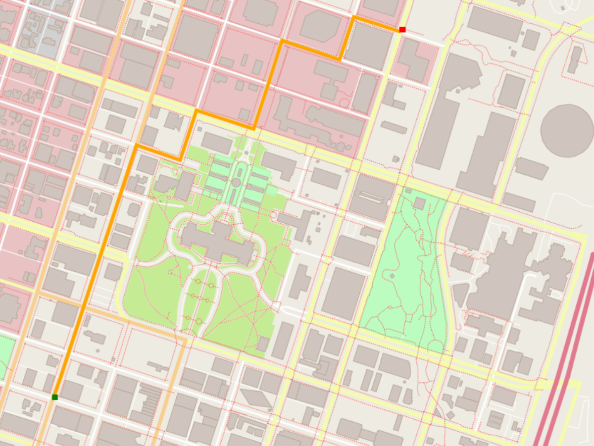

# Udacity C++ Nanodegree Projects

This repo contains projects of the [Udacity C++ Nanodegree](https://www.udacity.com/course/c-plus-plus-nanodegree--nd213#plans) projects.

## [Route Planning Project](https://github.com/ikamii/udacity-cpp-nd/tree/main/CppND-Route-Planning-Project)
Route planner that plots a path between two points on a map using real map data from the [OpenStreeMap project](https://www.openstreetmap.org/#map%253D7%252F51.330%252F10.453). 

## [System Monitor Project](https://github.com/ikamii/udacity-cpp-nd/tree/main/CppND-System-Monitor-Project)
System Monitor for Linux like [htop](https://htop.dev/).

## [Chatbot](https://github.com/ikamii/udacity-cpp-nd/tree/main/CppND-Memory-Management-Chatbot)
The ChatBot project creates a dialogue where users can ask questions about some aspects of memory management in C++.

## [Concurrent Traffic Simulation](https://github.com/ikamii/udacity-cpp-nd/tree/main/CppND-Concurrent-Traffic-Simulation)
A suitable and thread-safe communication protocol between vehicles and intersections to complete the simulation.

## [Snake](https://github.com/ikamii/udacity-cpp-nd/tree/main/CppND-Capstone-Snake-Game)

2D Snake Game.

